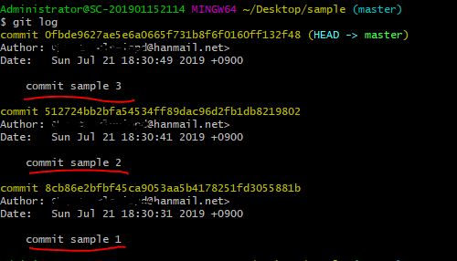
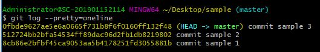
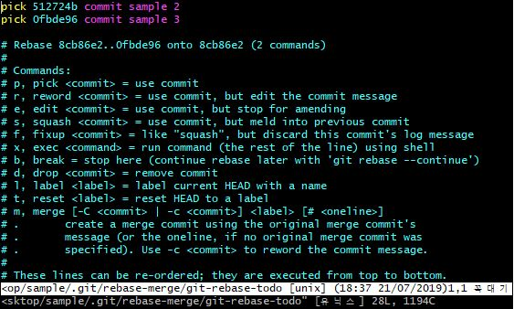
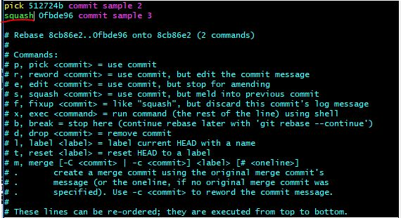
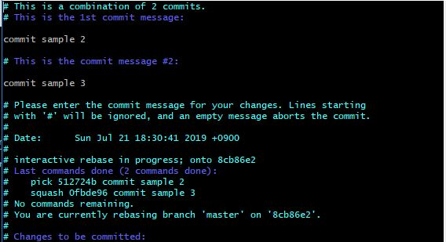
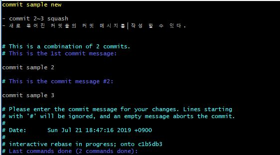
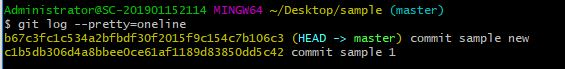

# Git - flow Chart - Feature 사용!

### 1. Git Branch 종류

##### 1. Master

   * 배포(Realse) 이력을 관리하기 위해 사용
   * **배포 가능한 상태만 관리!**

##### 2. Develop Branch

   * `기능 개발을 위한 Branch` (Feature Branch)들을 병합`(Merge)`하기 위해 사용
   * 기능의 추가, 버그 수정 등 개발이 완료된 Feature들이 병합`(Merge)` 된다.
   * 배포가 가능한 안정적인 상태라면 `Master Branch`에 병합(`merge`)한다.

##### 3. Feature Branch

   * 새로운 기능의 개발 및 버그 수정이 필요할 때 마다 `Develop Branch`로 부터 분기 하여 사용한다.
   
   * `Feature Branch` 의 작업은 공유할 필요가 없기 때문에 로컬 저장소에서 관리한다.

	* 개발이 완료 되면, `Develop Branch`로 병합(`merge`)하여 공유한다.
	
	   > 1. ‘develop’ 브랜치에서 새로운 기능에 대한 feature 브랜치를 분기한다.
	   > 2. 새로운 기능에 대한 작업 수행한다.
	   > 3. 작업이 끝나면 ‘develop’ 브랜치로 병합(merge)한다.
	   > 4. 더 이상 필요하지 않은 feature 브랜치는 삭제한다.
	   > 5. 새로운 기능에 대한 ‘feature’ 브랜치를 중앙 원격 저장소에 올린다.(push)
   
   * 브랜치 이름은 `feature/기능요약` 으로 정한다.
   
      * ex) `feature/login` 등
   
   * 브랜치 생성
   
      * feature 브랜치(feature/login)를 'develop' 브랜치 에서 분기
       
         ​	(<u>*'master' 브랜치에서 따는 것이 아니다!*</u>)
      
	      ```bash
      		git checkout -b feature/login develop
	      ```
   
   * 개발 종료 후`develop`브랜치와 병합
   
      1. `Develop Branch`로 이동
      
         ```bash
         git checkout develop
         ```
      
      2. `develop branch`에 feature/login 브랜치 내용을 병합(`merge`)한다.
      
         ```bash
         git merge --no-ff feature/login
         ```
      
         * `--no-ff` : 새로운 커밋 객체를 만들어 ‘develop’ 브랜치에 merge 한다.
      
           **‘feature’ 브랜치에 존재하는 커밋 이력을 모두 합쳐서 하나의 새로운 커밋 객체를 만들어 ‘develop’ 브랜치로 병합(merge)**
      
      3. 병합(`merge`)이 완료된 `branch` 삭제
      
         ```bash
         git branch -d feature/login
         ```
      
         * `-d` : branch 삭제 명령어
      
      4. Repository에 `push`
      
         ```bash
         git push origin develop
         ```


-------------------------------------------------

### 추가 사항으로서 이번 프로젝트에서는 feature 분리까지만 진행 하도록 하자!

----------------------------------------------------


##### 4. Release Branch

> 배포 전용 `branch` 의 사용은 배포를 준비 하는 동안 버전 업을 위한 기능 개발을 계속 할 수 있다는 장점이 있다.

1. ‘develop’ 브랜치에서 배포할 수 있는 수준의 기능이 모이면 또는 정해진 배포 일정이 되면, release 브랜치를 분기한다.
   * release 브랜치를 만드는 순간부터 배포 사이클이 시작된다.
   * release 브랜치에서는 배포를 위한 최종적인 버그 수정, 문서 추가 등 릴리스와 직접적으로 관련된 작업을 수행한다.
   * 직접적으로 관련된 작업들을 제외하고는 release 브랜치에 새로운 기능을 추가로 병합(merge)하지 않는다.

2. 'release’ 브랜치에서 배포 가능한 상태가 되면(배포 준비가 완료되면)

   * 배포 가능한 상태: 새로운 기능을 포함한 상태로 모든 기능이 정상적으로 동작 하는 상태

   1. ‘master’ 브랜치에 병합한다. (이때, 병합한 커밋에 Release 버전 태그를 부여!)
   2. 배포를 준비하는 동안 release 브랜치가 변경되었을 수 있으므로 배포 완료 후 ‘develop’ 브랜치에도 병합한다.


##### 5. Hotfix Branch

> 배포한 버전에 긴급하게 수정을 해야 할 필요가 있을 경우, ‘master’ 브랜치에서 분기하는 브랜치.바로 배포가 가능한 ‘master’ 브랜치에서 직접 브랜치를 만들어 필요한 부분만을 수정한 후 배포한다.

1.  배포한 버전에 긴급하게 수정을 해야 할 필요가 있을 경우,
   * ‘master’ 브랜치에서 hotfix 브랜치를 분기한다. (‘hotfix’ 브랜치만 master에서 바로 딸 수 있다.)
2. 문제가 되는 부분만을 빠르게 수정한다.
   * 다시 ‘master’ 브랜치에 병합(merge)하여 이를 안정적으로 다시 배포한다.
3. 새로운 버전 이름으로 태그를 매긴다.
   * hotfix 브랜치에서의 변경 사항은 ‘develop’ 브랜치에도 병합(merge)한다.
     

---------------------------------------------------------------------------

### 2. Squash

> `Squash`를 통해 commit을 묶어 좀더 가독성이 좋은 commit으로 만들어 보자!

* 사실 `squash`라고 하는 명령어는 없다.
* `interactive rebase`를 통해 여러 commit을 묶어 사용 가능 하다.

1. commit을 보기 흉하게 한다. (일부러 할 필요는 없다...)

   ```bash
   git log
   ```

   * 위의 명령어로 `commit log`를 확인 할 수 있다.

   

   OR

   

   ```bash
   git log --pretty=oneline
   ```

   * 명령어로 한눈에 볼 수도 있다.

   

   * 이렇게 3개의 commit이 준비되어 있다.

2. Commit 합치기

   ```bash
   git rebase -i HEAD~2
   ```

   * 위의 명령어를 통해 현재 쌓여 있는 커밋 2개를 묶을 수 있다.

   

   * 마지막 commit 으로부터 2개까지 묶이는 것을 확인 가능 하다.

   

   * 첫번째 줄 이외의 `pick`을 `squash`로 변경한 후 저장, 종료 한다(`:wq`).

     

   * Commit 을 새로 작성 할 수 있다.

     

   * 확인

     


### 2. Rebase

> Git에서 한 브랜치에서 다른 브랜치로 합치는 방법은 두 가지가 있다.
>
> 하나는 `Merge`이고 다른 하나는 `Rebase`다.

##### 1. Merge

* 장점
  * 이해하기 쉬움
  * 원래 브랜치의 컨텍스트를 유지함.
  * Fast-Forward Merge 를 하지 않는다면 브랜치 별로 커밋을 분리해 유지. 특히 이런 분리는 기능 브랜치에 유용.
  * 원래 브랜치의 커밋들은 변경되지 않고 계속 유지되어 다른 개발자들의 작업과 공유되는 것에 대해 신경쓸 필요가 없음.
* 단점
  * 단순히 모든 사람들이 같은 브랜치에서 작업하기 때문에 머지해야할 때는 merge 가 커밋 히스토리상으로 전혀 유용하지 않고 어지럽기만 하다.


##### 2. Rebase

* 장점
  - 단순한 히스토리
  - 여러 개발자들이 같은 브랜치를 공유할 때 커밋을 합치는 가장 직관적이고 깔끔한 방법.

* 단점
  * 충돌상황에서 다소 복잡. 커밋 순서대로 Rebase 를 하는데, 각 커밋마다 충돌해소를 순서대로 해주어야 한다. SourceTree 가 가이드하기는 하지만, 역시 복잡한 것은 사실이다.
  * 해당 커밋들을 다른 곳에 푸시한 적이 있다면 히스토리를 다시쓰는 것에 부작용이 발생한다. Mercurial 에서는 간단히 푸시를 할 수 없다. Git 에서는 Push 할 수 있으나 당신 혼자 쓰는 리모트 브랜치에만 가능하다. 만약 다른 사람이 그 브랜치를 체크아웃 받은 후 당신이 리베이스 한다면 꽤 혼란스럽게 될 것이다.


##### 간단히 이야기 하면, Merge는 병렬 형태의 commit이 merge시 하나의 node로 합쳐 지는 것,

##### Rebase는 이전 Commit log와 병합하여 직렬 node로 commit 로그가 형성 되는 것이다.


##### %% Rebase는 Commit 그래프가 순차적으로 정리 되는 엄청난 장점이 있지만 Rebase 실행시 꼬일 가능성이 높고 conflict를 하나하나 풀어주어야 한다. %%


* rebase 하기.

  1. `rebash`를 한다.

     ```bash
     git pull --rebase <remote> <branch>
     ```

     * 로컬 환경에서 `develop` 또는 `master` 등 push 할 상위 branch를 `pull -rebash` 받아 온다.

  2. `push` 를 한다.

     * 끝!